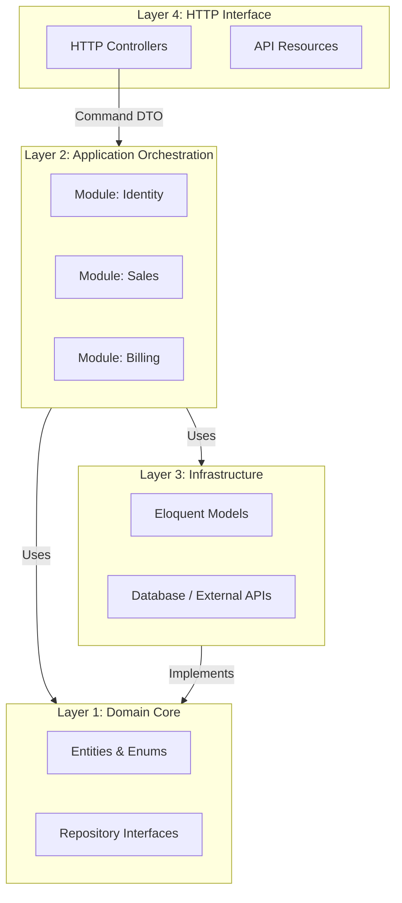

Vito Business OS is a **modular monolith** built on **Hexagonal (Ports & Adapters)** principles. Instead of the traditional Laravel pattern of Controller → Model, the system is partitioned by **business domain** — the directory structure tells you what the platform does, not which framework it runs on.

<Note>
This architecture is not optional. Every structural rule described here is enforced by the CI pipeline. A build that violates layer boundaries will fail before merge.
</Note>

## The four layers

| Layer | Directory | Responsibility | Strict prohibitions |
|-------|-----------|----------------|---------------------|
| **1. Domain Core** | `app/Domain/{Module}` | Pure business logic. Contains Entities, Enums, Value Objects, Domain Events, and Repository interfaces (Ports). | No `Eloquent`, no `Http`, no `Jobs`. |
| **2. Application Orchestration** | `app/Application/{Module}` | Use-case orchestration. Segregated into `Commands`, `Handlers`, and `Results`. | No SQL logic. No `Request` or `Response` objects. |
| **3. Infrastructure** | `app/Infrastructure` | Adapter implementations. Eloquent Models, Repositories, Mappers, and external service adapters. | No business rules. The only layer where `Eloquent` lives. |
| **4. HTTP Interface** | `app/Http` | Delivery mechanism. Controllers, Form Requests, API Resources. | No business logic. Controllers must stay under 50 lines. |

## Dependency direction

Dependencies flow **inward only**. The Domain Core knows nothing about Laravel, databases, or HTTP. Every outer layer depends on inner layer contracts — never the reverse.

## Screaming architecture

The folder structure announces the business, not the framework. Opening `app/Domain` reveals `Identity`, `Sales`, `Billing`, `Booking`, `Marketing` — not `Models`, `Services`, or `Helpers`.

This is intentional. A new developer should be able to read the directory tree and understand what the platform does before opening a single file.

## Additional surfaces

Beyond the four core layers, the platform has dedicated surfaces for admin panels and frontend:

| Directory | Purpose |
|-----------|---------|
| `app/Filament` | Filament 4.2 panels, pages, resources, and widgets |
| `resources/js` | Inertia + React 18 + TypeScript frontend |
| `resources/schemas` | JSON Schema contracts published to consumers |
| `proto/` | gRPC proto contracts |

## Quality gates

Three automated gates run on every push:

<CardGroup cols={3}>
  <Card title="Architecture tests" icon="shield-check">
    Pest `ArchTest` blocks `Eloquent` in Application, `Http` in Domain, and enforces `final readonly` on all Commands and Results.
  </Card>
  <Card title="Static analysis" icon="magnifying-glass">
    PHPStan / Larastan at Level 5. Blocks type errors, undefined methods, and incorrect null handling.
  </Card>
  <Card title="Type sync trap" icon="arrows-rotate">
    `php artisan typescript:transform` must be run before push. CI fails if `generated.d.ts` has uncommitted changes.
  </Card>
</CardGroup>
